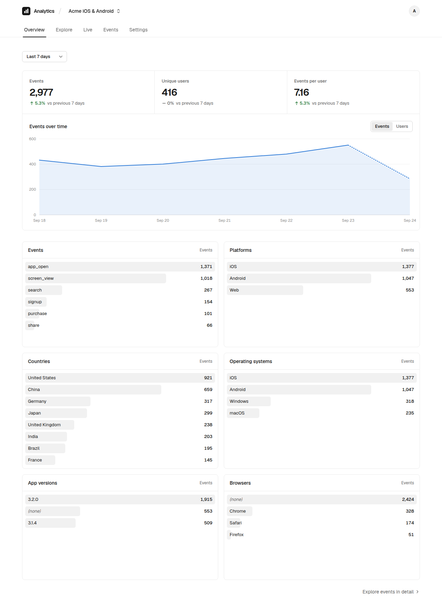
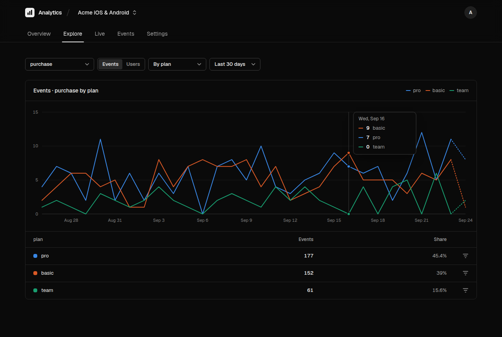
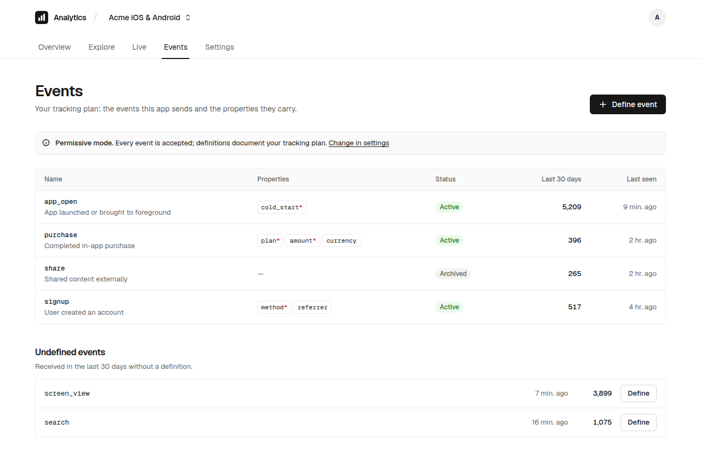

# Serverless Analytics

一个跑在 Serverless 环境里的埋点分析服务。客户端把事件**攒成批次提交**，服务端校验、补全后写入数据库，在看板里分析。

- **Serverless**：部署到 Cloudflare Workers（D1 + KV）或 Vercel（Postgres / Supabase），没有需要维护的服务器，空闲时几乎零成本。
- **分批次提交**：Web、Android、iOS、桌面端通过一个 HTTP 接口 `POST /v1/batch` 一次提交多个事件；整批只用一条 SQL 写入，带幂等 id，失败重试不会重复计数。
- **可自部署**：数据库、缓存、队列都通过环境变量切换，数据留在你自己的账号里。



## 特性

- **自定义事件（Tracking plan）**：在看板中定义事件及其属性（类型、是否必填）。*Permissive* 模式下接收所有事件、定义用于文档；*Strict* 模式下拒绝未定义或不合规的事件。已上报但未定义的事件会列出来，可一键定义（自动推断属性类型）。
- **多 App**：一个部署管理多个 App，每个 App 有独立的 write key、事件定义、数据保留期。
- **分析**：总览（事件数、去重用户、环比、各维度 Top N，点击即筛选）、Explore（按事件 / 指标 / 任意属性或维度分组 + 筛选）、Live 实时事件流。
- **存储可切换**：数据库 **Cloudflare D1** 或 **Postgres（Supabase / Neon / …）**；KV **Cloudflare KV** / **Upstash** / 内存；队列 **同步** / **后台** / **Cloudflare Queues** / **Upstash QStash**。
- **可靠上报**：批量、gzip、幂等去重、时钟偏差修正、`sendBeacon`；自带 3.8 KB 的 Web SDK。
- **Vercel 风格看板**：简洁、高效，支持明暗主题、键盘操作，筛选状态保存在 URL 里。

| Explore（暗色） | 事件定义 |
| --- | --- |
|  |  |

## 快速开始（本地）

需要 Node 20+ 与 pnpm。

```sh
pnpm install
cp apps/cloudflare/.dev.vars.example apps/cloudflare/.dev.vars   # 设置 ADMIN_PASSWORD
pnpm build                                                        # 构建看板与 SDK
pnpm --filter @serverless-analytics/cloudflare dev                # http://localhost:8787
```

打开 http://localhost:8787 → 输入密码 → **Initialize database** → **New app** → 按页面上的示例发送第一个事件。

开发看板时可以另开一个终端运行 `pnpm --filter @serverless-analytics/dashboard dev`（http://localhost:5173，API 会代理到 8787）。

## 部署

### Cloudflare（D1 + KV，推荐）

```sh
pnpm install
cd apps/cloudflare
npx wrangler login
npx wrangler secret put ADMIN_PASSWORD
cd ../.. && pnpm deploy:cloudflare
```

首次部署时会自动创建 D1 数据库和 KV 命名空间。部署后打开 Worker 地址，初始化数据库即可。启用 Cloudflare Queues 或改用 Postgres（Hyperdrive）请参考 [配置文档](docs/CONFIGURATION.md)。

### Vercel（Postgres / Supabase）

1. 导入仓库，把 **Root Directory** 设为 `apps/vercel`（`vercel.json` 已包含安装与构建命令）。
2. 设置环境变量：`ADMIN_PASSWORD`、`DATABASE_URL`（Supabase 请使用 6543 端口的 Pooler 连接串）、`CRON_SECRET`；可选 `UPSTASH_REDIS_REST_*`、`QUEUE_DRIVER=qstash` 等。
3. 部署后打开站点并初始化数据库。

## 上报事件（批量）

客户端在本地排队，按「攒够 N 条」或「每隔几秒」打包成一批提交；页面关闭或 App 退到后台时立刻提交剩余事件。

```
客户端队列 ──(每批 ≤ 100 条，可 gzip)──▶ POST /v1/batch ──▶ 校验 / 补全 ──▶ 队列驱动 ──▶ 一条 SQL 写入整批
```

- 每个事件带客户端生成的 `id`，服务端按 `(app, id)` 去重，重试安全。
- 批次里的坏事件单独返回在 `rejected` 里，不影响同批其他事件。
- 带上 `sentAt`，服务端会修正设备时钟偏差。
- 写库方式由 `QUEUE_DRIVER` 决定：同步写入、后台写入，或经 Cloudflare Queues / Upstash QStash 再合并成更大的批次。


```sh
curl -X POST https://<your-deployment>/v1/batch \
  -H "Authorization: Bearer <write key>" -H "Content-Type: application/json" \
  -d '{"events":[{"id":"<uuid>","name":"purchase","anonymousId":"device-123","properties":{"plan":"pro","amount":29}}]}'
```

```ts
import { createAnalytics } from '@serverless-analytics/sdk'

const analytics = createAnalytics({
  endpoint: 'https://<your-deployment>',
  writeKey: '<write key>',
  flushAt: 20, // 攒够 20 条提交一批
  flushInterval: 5000, // 或每 5 秒提交一次
})
analytics.identify('user-42')
analytics.track('purchase', { plan: 'pro', amount: 29 })
```

完整协议（Android / iOS 等原生客户端对接）见 [HTTP API](docs/HTTP_API.md)。

## 文档

- [架构设计](docs/ARCHITECTURE.md)：技术选型、请求流、存储与方言层、队列语义、缓存、安全
- [配置参考](docs/CONFIGURATION.md)：全部环境变量、兼容矩阵、平台配置方法、配置向导问题树
- [上报协议](docs/HTTP_API.md)

## 开发

```sh
pnpm typecheck   # 所有包的类型检查
pnpm test        # core：同时在 SQLite（D1）与 Postgres（PGlite）上测试；sdk 单元测试
pnpm build
```

```
packages/core      平台无关的核心（Hono app、存储、KV、队列、上报）
packages/sdk       Web / Electron / Node SDK
apps/cloudflare    Cloudflare Worker 入口
apps/vercel        Vercel 入口（Build Output API）
apps/dashboard     看板（React + Vite + Tailwind）
```
